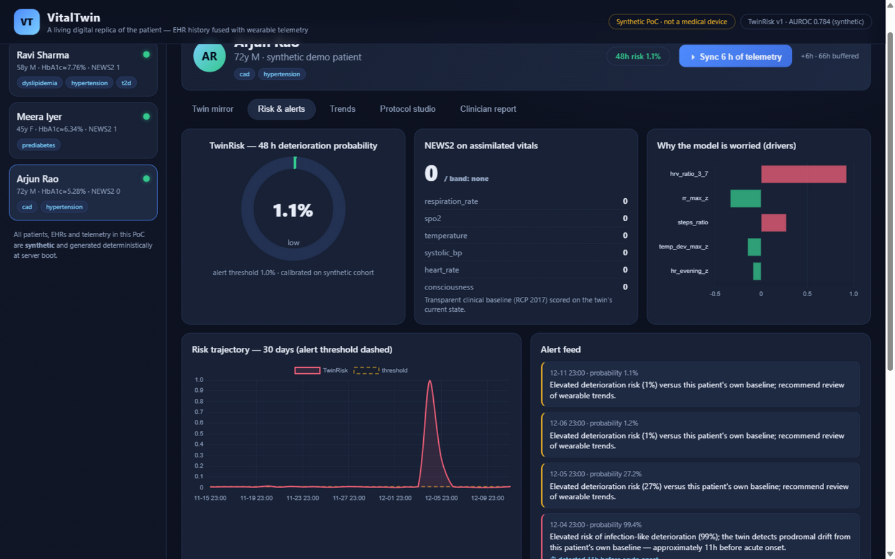

team name :Roxx

college: Vellore Institute of technology

# VitalTwin — a patient digital twin that predicts, then prescribes

> **Happiest Health Digital Twin Challenge 2026 — Prototype & Code Submission**
>
> A living digital replica of a patient: **EHR history fused with real-time
> wearable telemetry** on one calibrated physiological model, so care can be
> **proactive, not reactive** — predicting adverse events *before* vitals
> derange, and simulating treatment protocols *before* they are prescribed.



## 📋 Submission checklist (official guidelines → where to find it)

| ✅ Guideline item | Where |
|---|---|
| **Project Title** | **VitalTwin** — a patient digital twin that predicts, then prescribes |
| **Problem Statement** | [Below](#-problem-statement) |
| **Healthcare Use Case** | [Below](#-healthcare-use-case) |
| **Technical Stack** | [Below](#-technical-stack) |
| **AI/ML Model or Framework Details** | [Below](#-aiml-model-details) + [`docs/evaluation.md`](docs/evaluation.md) + model card at `GET /api/model` |
| **Demo Video (15–20 min, unlisted YouTube)** | 🎬 **[TODO: paste unlisted YouTube link here after recording]** — recording script: [`docs/demo_walkthrough.md`](docs/demo_walkthrough.md) |
| **Open-source License Details** | [MIT License](LICENSE) |
| **Architecture Diagram (PDF/PPT)** | [`docs/architecture_diagram.pptx`](docs/architecture_diagram.pptx) |
| **Presentation (PDF/PPT, project + outcomes)** | [`docs/VitalTwin_Pitch.pptx`](docs/VitalTwin_Pitch.pptx) |
| **All files & links publicly accessible** | This repository is public; no login, keys or permissions needed to run or review anything |

## 🎬 Demo video

**[TODO — paste your unlisted YouTube link here, e.g. https://youtu.be/… ]**

The recommended 15–20 minute recording flow is scripted beat-by-beat in
[`docs/demo_walkthrough.md`](docs/demo_walkthrough.md) (start the app with
`python run.py`, walk through the live sync → early-warning → protocol
studio → goal-seek → clinician report sequence, then the code tour).

## ❗ Problem statement

> *"The future of medicine is proactive, not reactive."* Static Electronic
> Health Records hold a patient's history but not their present; raw
> wearable/IoMT telemetry shows numbers without physiological context. The
> challenge asks for a **Proof-of-Concept Digital Twin model that acts as a
> dynamic, virtual replica of a patient — integrating real-time data from
> wearables with EHR** — to **predict adverse health events** and
> **personalize treatment protocols**.

VitalTwin implements exactly this loop: EHR data calibrates the twin,
wearable telemetry keeps it live, one physiological model serves both early
warning and treatment simulation.

## 🏥 Healthcare use case

**Care setting:** home/community monitoring of chronic-disease patients
between clinic visits (India's largest care gap), plus post-discharge
monitoring after cardiac events.

Three concrete clinical scenarios ship as synthetic demo patients:

1. **Early warning of acute deterioration** — *Arjun Rao, 72, post-PCI*:
   the twin detects the prodrome of an infection-like deterioration
   (resting-HR drift, HRV suppression, low-grade fever) **~11–35 hours
   before acute onset**, while NEWS2 still reads normal. Value: earlier
   review, fewer ER transfers for home-monitored elderly.
2. **Chronic metabolic management** — *Ravi Sharma, 58, T2D + hypertension*:
   simulate metformin titration, walking plans and diet changes on the twin
   before prescribing; goal-seek the smallest metformin dose reaching
   target HbA1c — including **safe deprescribing** when lifestyle alone
   suffices. Value: protocol personalization with evidence, not guesswork.
3. **Prevention / risk reversal** — *Meera Iyer, 45, prediabetes*: project
   the HbA1c trajectory under a walking + diet protocol and quantify the
   reversal. Value: motivating, quantified behavior change.

## 🧰 Technical stack

| Layer | Technology |
|---|---|
| Twin engine | Pure Python 3 (deterministic, dependency-free numerics) |
| API | FastAPI + Pydantic, Swagger at `/docs` |
| Dashboard | Vanilla JS + Chart.js (vendored — runs offline), zero build step |
| ML | From-scratch logistic regression (standardized features, L2), pure-Python metrics (AUROC/AP) |
| Storage | In-memory deterministic store (PoC); FHIR-lite EHR schema; JSONL/CSV schemas defined |
| Testing / CI | pytest (26 tests), GitHub Actions on Python 3.11–3.13 |
| Clinical grounding | NEWS2 (RCP 2017), ADAG HbA1c, Bergman minimal-model structure, HRV Task Force, Mifflin-St Jeor |

## 🤖 AI/ML model details

**TwinRisk v1** — 48-hour deterioration probability (model card: `GET /api/model`).

- **Task:** given a patient-day of assimilated wearable/CGM summaries with
  personal baselines from the prior 14 days (no future leakage), predict
  infection-like acute deterioration within 48 h.
- **Features (19):** personalized z-scores of resting/evening HR, night/
  evening HRV, HR↑+HRV↓ composite, sleep debt & fragmentation, SpO₂ dips,
  glycaemic variability & TIR, skin-temp trend, respiration rate, plus age,
  BMI, comorbidity count.
- **Model:** logistic regression with L2 (chosen for calibration +
  explainability); pure-Python training (gradient descent). Weights,
  standardization params and training metadata ship in
  `app/models/twinrisk_v1.json`.
- **Training/eval pipeline:** `scripts/train_risk_model.py` generates the
  cohort (120 patients × 180 days), assimilates every stream with the *same
  mirror code the live app uses* (no training/serving skew), splits by
  patient, trains, and writes metrics.
- **Results (held-out patients):** AUROC 0.784 · AP 0.493 (≈30× prevalence)
  · sensitivity 0.70 @ specificity 0.77 · **mean lead time ≈18.5 h** · ROC
  sweep committed in [`docs/evaluation.md`](docs/evaluation.md).
- **Other intelligence in the system:** Kalman-filter state assimilation,
  goal-seek optimizer over the twin's response surface, one-at-a-time lever
  ablation for explanation.

## What it does

| Capability | How it works | Where |
|---|---|---|
| **Mirror** — a live physiological replica | Wearable/CGM telemetry assimilated (per-channel Kalman + circadian personal baselines) onto a physiology model calibrated from the EHR | Live sync, `app/engine/assimilation.py` |
| **Predict** — adverse events before they happen | TwinRisk: explainable logistic model over 19 personalised drift features → 48-hour deterioration probability with **~18.5 h mean lead time** (AUROC 0.784, AP 0.493 ≈ 30× prevalence on the synthetic validation cohort) | `app/engine/risk.py`, `docs/evaluation.md` |
| **Alarm** — current-state safety net | Three tiers: absolute-threshold alarms (hypo/hyperglycaemia, SpO₂, BP, HR) + NEWS2 on assimilated vitals + TwinRisk early warning | `app/store.py` |
| **Simulate** — protocols before prescriptions | The same forward model run 30–180 days ahead under medication/lifestyle levers: HbA1c, weight, BP, resting HR/HRV, TIR trajectories vs the current protocol | Protocol Studio, `app/engine/protocols.py` |
| **Prescribe** — the twin as prescription | Goal-seek finds the *smallest* lever change reaching a clinical target, with a ±10 % physiology jitter band — including safe deprescribing | Goal seek in Protocol Studio |

Three synthetic demo patients ship with scripted, deterministic stories:
**Arjun Rao** (72, post-PCI — deterioration early-warning), **Ravi Sharma**
(58, T2D + hypertension — protocol optimisation), **Meera Iyer** (45,
prediabetes — prevention).

## Quickstart (2 minutes)

```bash
pip install -r requirements.txt
python run.py                    # → http://127.0.0.1:8000
```

Then follow the on-screen demo script (also `docs/demo_walkthrough.md`):

1. Select **Arjun Rao** → press **⏵ Sync 6 h of telemetry** repeatedly —
   watch TwinRisk cross the alert threshold during the prodrome, hours
   before any vital breaches NEWS2.
2. Select **Ravi Sharma** → **Protocol studio** → set levers →
   **▶ Simulate on twin** → then **🎯 Find smallest change** to goal-seek
   the minimum metformin dose for a target HbA1c.

API docs at `/docs` (Swagger). Re-run tests with `python -m pytest tests/ -q`.

## Architecture in one picture

```text
EHR (FHIR-lite) ──► Calibration ──► Physiological forward model (hourly)
                                        ▲                    │
Wearable/CGM ──► Assimilation ──► Assimilated state ──► Risk engine (NEWS2 + TwinRisk)
   telemetry      Kalman + baselines      │                    │
                                          └──► Protocol Studio (what-if, goal-seek)
                                                                       │
                                                            Alerts ◄───┘
```

Every equation and constant is documented with its literature anchor in
[`docs/clinical_model.md`](docs/clinical_model.md); the system design and
production scaling path are in [`docs/architecture.md`](docs/architecture.md).

## Measured results (synthetic cohort — see threats-to-validity)

| Metric | Value |
|---|---|
| TwinRisk 48 h deterioration AUROC | **0.784** |
| Average precision (prevalence 1.7 %) | **0.493** (~30× base rate) |
| Sensitivity / specificity at deployed threshold | **0.70 / 0.77** |
| Mean lead time when detected | **≈ 18.5 h** |
| Assimilation fidelity | HR MAE 3.7 bpm · glucose MAE 3.0 mg/dL · SBP 5.1 mmHg (at sensor noise floor) |
| Protocol engine | Lifestyle: −0.6 % HbA1c, −3.5 kg / 90 d (DPP-magnitude); metformin dose–response monotone |

**All data in this repository is synthetic** — generated deterministically,
no real patients anywhere. The evaluation therefore demonstrates internal
consistency of the architecture, not clinical validity; the honest
limitations and the clinical-validation roadmap are in
[`docs/limitations_roadmap.md`](docs/limitations_roadmap.md) and
[`docs/privacy_and_ethics.md`](docs/privacy_and_ethics.md).

## Repository layout

```
app/
  engine/        physiology, events, assimilation, features, risk, protocols
  data/          archetypes + synthetic generator (sensor noise models)
  models/        TwinRisk v1 weights + training metadata (committed)
  main.py        FastAPI service layer      store.py  deterministic patient store
frontend/        zero-build dashboard (vanilla JS + vendored Chart.js)
tests/           26 tests: clinical plausibility gates, no-leakage, API contract
scripts/         train_risk_model.py (retrains + re-evaluates end-to-end)
docs/            architecture, clinical model, evaluation, data dictionary,
                 API reference, privacy & ethics, limitations & roadmap, demo script
```

## Reproducing the model

```bash
python scripts/train_risk_model.py --patients 120 --days 180 --seed 2026
# generates the cohort, assimilates, trains, evaluates, and writes
# app/models/twinrisk_v1.json + docs/evaluation.json (~60 s, pure Python)
```

## Team & licence

Built for the Happiest Health *Reimagining & Reforming Healthcare in India
Summit 2026* Digital Twin Challenge. MIT licence — see
[LICENSE](LICENSE). Not a medical device; not for clinical use.
